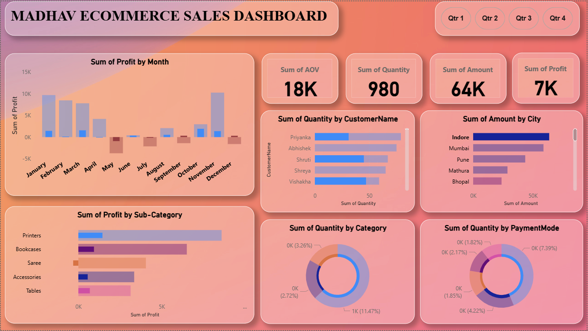

# 🛍️ Madhav Ecommerce Sales Analysis Dashboard

This repository contains an interactive **Ecommerce Sales Analysis Dashboard** built using **Microsoft Power BI**. The dashboard provides deep insights into key performance metrics, customer behavior, sales trends, and profitability across time and geography.

> ⚠️ **Note:** This is a **demo project** created for learning and presentation purposes.

---

## 📊 About the Project

The Madhav Ecommerce Sales Dashboard is designed to help business stakeholders monitor and evaluate the performance of an online retail store. By analyzing monthly profits, customer orders, regional sales distribution, and category-wise trends, it offers a comprehensive view of the business health.

---

## 🔍 Key Features

### 1. **Monthly Profit Tracking**
- Visualized using a bar chart showing **Sum of Profit by Month**.
- Easily identifies profitable and loss-making months (e.g., losses in June and September).

### 2. **KPI Metrics (Top Cards)**
- **AOV (Average Order Value)**: ₹121K  
- **Total Quantity Sold**: 6K units  
- **Total Revenue (Amount)**: ₹438K  
- **Total Profit**: ₹37K  

### 3. **Customer-wise Insights**
- Bar chart showing **Quantity Purchased by Top Customers** like Priyanka, Abhishek, and Shruti.

### 4. **City-wise Revenue Analysis**
- Horizontal bar chart detailing **Sales Amount by City** including Indore, Mumbai, and Pune.

### 5. **Sub-category Profitability**
- Clear breakdown of **Profit by Sub-Category** (e.g., Printers, Bookcases, Sarees).
- Helps in identifying high-margin products.

### 6. **Category-wise Sales Distribution**
- Donut chart visualizing **Quantity by Product Category**.
- Offers percentage share for each category (e.g., 62.62%, 20.55%, etc.).

### 7. **Payment Mode Distribution**
- Donut chart showing **Quantity by Payment Mode**.
- Useful for analyzing customer payment preferences (e.g., UPI, Credit Card, COD, etc.).

### 8. **Quarter Filter**
- Allows dynamic filtering of reports by Quarter (Q1, Q2, Q3, Q4).

---

## 🛠️ Built With

- **Microsoft Power BI** – For interactive dashboard creation  
- **DAX and Power Query** – For data modeling and transformation  
- **CSV/Excel** – As a data source (assumed)  
- **Custom Visuals & Formatting** – For aesthetic and analytical enhancement  

---

## 📌 Usage

1. Clone the repository.
2. Open the Power BI `.pbix` file (if provided) in **Power BI Desktop**.
3. Explore insights using filters and slicers (e.g., by Quarter).
4. Customize as needed for different products, locations, or time periods.

---

## 📷 Dashboard Preview



---

## 📁 Repository Structure

```
📦 madhav-ecommerce-dashboard
 ┣ 📊 dashboard.png
 ┣ 📈 Ecommerce sales dashboard.pbix
 ┗ 📄 README.md
```
